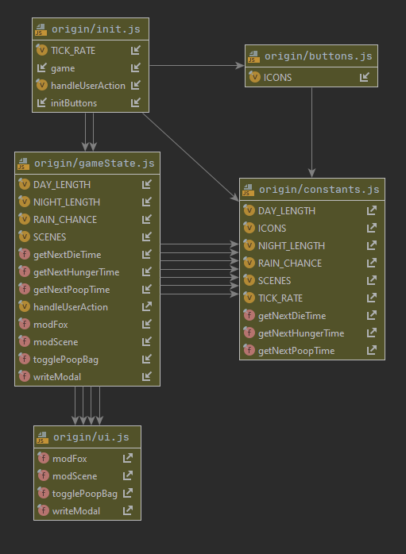
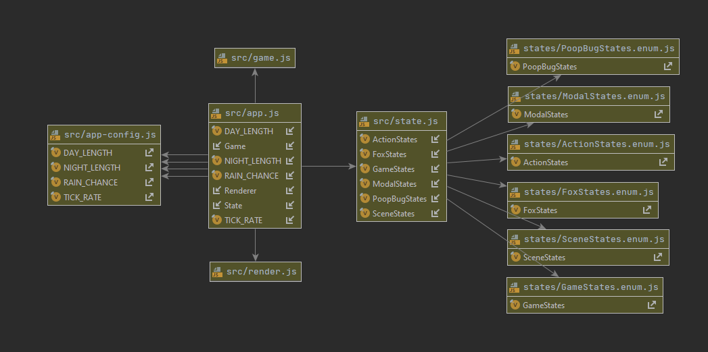

# Fox Game

## About

My variation of this one:

https://btholt.github.io/project-fox-game-site/the-project

This is original solution:

https://btholt.github.io/project-fox-game-site/

https://github.com/btholt/project-fox-game-site

https://github.com/btholt/project-files-for-fox-game

### Description

### Origin source code

Origin source code has multiple connection between entities.

DOM manipulation exec from many files.

Select action by selected icon (not from state).

GameState like a god object - has multiple responsibilities.

### My source code

My source code (js from scratch, html + CSS from origin game).

App State declaratively determined via enums.

No strong coupling between entities.

App.js - init app and timer

App-config.js - few constants for configuraion

State.js - only manage state with switch statement (each state fully declared in enum)

Game.js - manage game flow, timer, state-transition

Render.js - do DOM manipulation + add/remove event listeners
